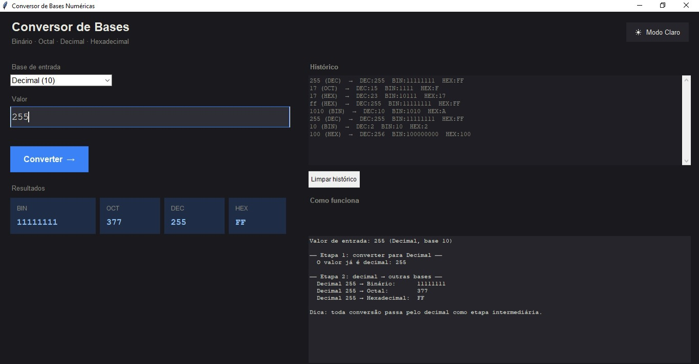

# 🔢 Conversor de Bases Numéricas

Uma aplicação desktop para converter números entre múltiplas bases, construída com Python e Tkinter.


---

## Funcionalidades

- ✅ Converte entre todas as bases: **Binário · Octal · Decimal · Hex · Base32 · Base64**
- 💡 **Display LED visual de bits** — cada bit exibido como um círculo colorido
- 🔁 **Complemento de dois** com explicação passo a passo
- 📖 Aba **"Faça à mão"** — aprenda a converter sem computador
- 📜 Painel de **histórico de conversões**
- 💾 Exportar histórico como `.txt`, `.csv`, `.json` ou `.pdf`
- 🌙 Alternância entre **modo escuro / claro**
- 🗂️ Código modular — separação clara entre lógica e interface

---

## Screenshots



---

## Como Executar

### Pré-requisitos

- Python 3.8 ou superior
- Tkinter (incluído na instalação padrão do Python)
- `reportlab` — necessário apenas para exportação em PDF

### Instalação

```bash
# Clonar o repositório
git clone https://github.com/seu-usuario/conversor-bases.git

# Entrar na pasta do projeto
cd conversor-bases

# (Opcional) Instalar reportlab para exportação em PDF
pip install reportlab
```

### Executando

```bash
python main.py
```

---

## Estrutura do Projeto

```
conversor-bases/
├── main.py                  # Ponto de entrada — orquestra todos os painéis
├── converter.py             # Lógica de conversão pura (sem UI)
└── app/
    ├── themes.py            # Temas de cores e constantes
    ├── panels/
    │   ├── header.py        # Barra superior com título e alternância de tema
    │   ├── main_panel.py    # Campo de entrada, LEDs e cards de resultado
    │   └── side_panel.py    # Abas: histórico, explicação, C2, manual
    └── widgets/
        ├── led_canvas.py    # Widget reutilizável de display LED de bits
        └── result_cards.py  # Grade reutilizável de cards de resultado
```

---

## Como a Conversão Funciona

Toda conversão usa o **decimal como etapa intermediária**:

```
Entrada (qualquer base) → Decimal → Base de destino
```

**Exemplo:** convertendo `1A` (hex) para binário:

1. `1A` hex → `26` decimal
2. `26` decimal → `11010` binário

---

## Complemento de Dois

Usado para representar números negativos em sistemas digitais:

```
+5  →  0000 0101   (original)
       0000 0101
       ---------
C1  →  1111 1010   (inverter todos os bits)
    +          1
       ---------
C2  →  1111 1011   (= -5 com sinal)
```

---

## Valores de Teste

| Entrada | Base        | BIN        | OCT | DEC | HEX |
|---------|-------------|------------|-----|-----|-----|
| `255`   | Decimal     | `11111111` | `377` | `255` | `FF` |
| `1010`  | Binário     | `1010`     | `12`  | `10`  | `A`  |
| `FF`    | Hexadecimal | `11111111` | `377` | `255` | `FF` |
| `17`    | Octal       | `1111`     | `17`  | `15`  | `F`  |

---

## Tecnologias

| Ferramenta    | Finalidade                              |
|---------------|-----------------------------------------|
| **Python 3**  | Linguagem principal                     |
| **Tkinter**   | Interface gráfica (stdlib, sem dependências extras) |
| **base64**    | Codificação Base32 / Base64 (stdlib)    |
| **reportlab** | Exportação em PDF (opcional)            |
